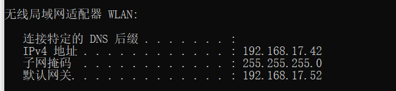
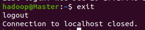
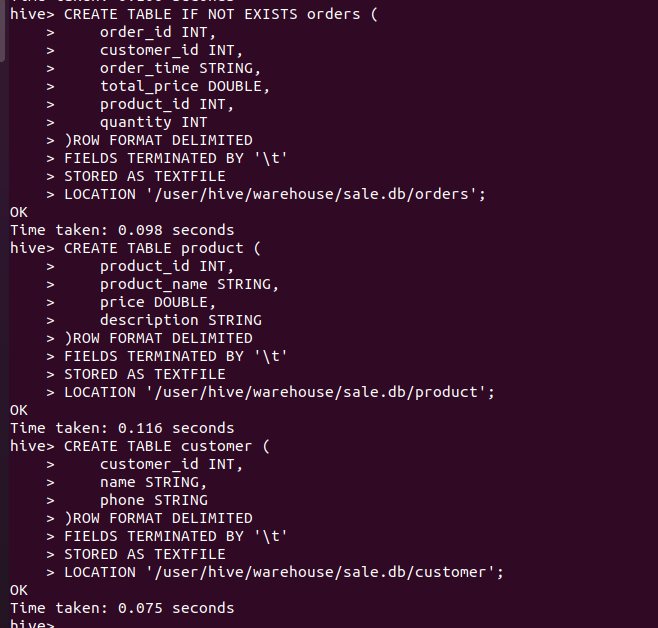

# 云计算项目文档

[TOC]

## 项目概述

本项目使用Hadoop和Hive来实现一个商品销售系统的销售部分，管理员可以查看商品信息、顾客信息和订单信息，可以根据需求对信息进行关键词检索。

### 系统架构

在本系统中，共有两台实体主机参与，每台主机上运行两台虚拟机，其中一台虚拟机作为**Master**节点(**NameNode**)，另外三台虚拟机作为**Slave1**、**Slave2**、**Slave3**节点(**DataNode**)。虚拟机使用的是VMware的Ubuntu操作系统。

Hadoop 分布式文件系统（**HDFS**）采用了一种主从架构，其中包括一个 NameNode 和多个 DataNode（在我们的系统中为3个）。NameNode 用于管理文件系统的元数据信息，负责存储文件系统的命名空间、安全、一致性以及数据块的位置等信息。它接收客户端的请求，包括文件系统操作、数据读写等，然后将这些请求转发给相应的 DataNode 进行处理。

DataNode负责存储实际的数据块。HDFS 中的文件被分成一个个的数据块，这些数据块可以有多个副本，分别存储在不同的 DataNode 上，以提高数据的可靠性和容错能力。DataNode 定期向 NameNode 汇报数据块的状态和位置信息，并且接收来自 NameNode 的指令，如删除数据块、复制数据块等。

Hive是基于Hadoop的一种可供查询的数据仓库，对用户端提供了CLI（命令行）、JDBC/ODBC（Hive的Java客户端）和Web GUI三种接口。其中Hive的元数据存储在MySQL中，Hive的数据存储在HDFS中，项目涉及的查询和计算由MapReducer完成。一般使用HQL来执行数据查询和操作，HQL是一种针对HDFS数据的查询操作语言，在Hive中使用解释器、编译器、优化器完成HQL查询语句从词法分析、语法分析、编译、优化以及查询计划的生成。生成的查询计划存储在HDFS中，并在随后有MapReduce调用执行。

在本项目，我们使用Hadoop作为计算和存储框架，并使用Hive作为数据仓库。系统的整体架构如下：


### 主要功能实现

**1.** **基本的文件读写功能**

对于读过程，其优势在于客户端可以直接连接到datanode进行数据的读取，这样由于数据分散在不同的datanode上，就可以同时为大量并发的客户端提供服务。而namenode作为管理节点，只需要响应数据块位置的请求，告知客户端每个数据块所在的最佳datanode即可（datanode的位置信息存储在内存中，非常高效的可以获取）。这样使得namenode无需进行具体的数据传输任务，否则namenode在客户端数量多的情况下会成为瓶颈。


在HDFS中，文件写入由客户端向NameNode发起请求，NameNode处理元数据，将文件分割成数据块并分配存储位置，选择合适的DataNode进行写入。数据块经过复制确保容错性，写入完成后更新元数据。该分布式存储系统通过多个节点合作，提供高可靠性和可用性，适用于大规模数据集的存储和管理。


**2.** **大文件分块存储**

Hadoop通过将大文件**分割成指定大小的数据块**并存储在分布式文件系统中，实现了高效的大规模数据存储和处理。HDFS上的文件被切割成默认为128MB的数据块，只有最后一个数据块的大小是变化的。而当新的数据写入使得数据块大小超过系统设定值之后，新的数据块会产生。这些数据块通过复制存储在多个节点上，以提高容错性和可用性。Hadoop利用数据分布式存储和并行处理的特性，能够在集群中并行执行任务，优化数据局部性并最大程度地利用计算资源，从而提高数据处理效率。

**3.** **节点失效时不影响其他节点**

在HDFS中，文件被分成多个数据块并存储在不同的节点上。每个数据块都会有多个副本，**默认情况下是三个副本**。这些副本会分布在集群的不同节点上，确保数据的冗余存储。当一个节点失效时，存储在该节点上的数据仍然可以从其他节点上的副本中读取。Hadoop会自动检测到节点的失效，并将受影响的数据块的读取请求重新路由到其他节点上存储的副本，确保数据仍然可用和完整。

**4.** **数据一致性**

HDFS会对所有写入的数据进行校验和计算，在读取数据时计算校验和，计算使用的是CRC32算法，校验和值会与数据块一起存储在HDFS中。当客户端请求读取数据块时，HDFS会同时返回对应的校验和。客户端接收数据后，会对接收到的数据块再次计算校验和，并与HDFS返回的校验和进行比较。如果客户端计算得到的校验和与HDFS返回的校验和一致，则数据传输或存储过程中没有出现错误；如果校验和不一致，则表示数据可能存在错误，客户端可以要求HDFS重新发送数据块，或者从其他副本中获取数据。

## Hadoop集群搭建及Hive配置过程

该过程中我们共使用了两台主机，每台主机上各搭建了两台虚拟机。

### 准备工作

#### Ubuntu虚拟机配置IP地址

由于我们采用的是用多台虚拟机而不是服务器来模拟hadoop集群，我们需要将所有虚拟机置于同一个局域网下，并配置相应的IP地址。

首先，打开手机热点，用两台主机分别连接同一个手机热点。（注意，这里**不能使用学校无线网**，因为它有使用的设备数限制）。连接好后，在主机输入 `ipconfig`查看对应的ip地址。




打开虚拟机，在设置中打开Network,点击Wired下方最右侧的设置图标，先选择点击 `Disable`选项。再点击IPv4选项卡，选择**Manual**手动配置IP，几台虚拟机的IP地址分别设置为 `192.168.17.35`、`192.168.17.36`、`192.168.17.37`、`192.168.17.38`。子网掩码、网关和DNS都分别设置为：`255.255.255.0`、`192.168.17.52`、`192.168.17.52`。保存并点击**Apply**。


到虚拟机的终端下运行`ifconfig`指令，发现ip未改变。查找原因后发现，是需要将虚拟机中的网络连接方式改为“桥接模式”。**桥接模式**和**NAT模式**是两种不同的网络连接模式。桥接模式将设备连接在同一网络上，使其处于相同的IP地址子网中，直接可见和访问彼此。而NAT模式通过为本地设备分配私有IP地址，并通过NAT将其流量映射到一个公共IP地址，实现多个设备通过单一公共IP地址访问Internet，提供了一定的隔离和安全性。

重启后虚拟机IP改变，设置成功。


#### 创建新hadoop用户

在虚拟机上使用创建用户命令：

```shell
 sudo useradd -m hadoop -s /bin/bash
```

接着为hadoop用户设置密码：

```shell
sudo passwd hadoop
```

然后为hadoop用户增加管理员权限，后续的操作都要在该用户上进行：

```shell
sudo adduser hadoop sudo
```

然后选择切换用户，用刚才创建的hadoop用户登录，打开终端，@前为hadoop则登录成功。


#### 设置SSH免密登录

首先更新 `apt-get`,使用命令 `sudo apt-get update`。

下载并安装SSH：

```shell
sudo apt-get install openssh-server
```


安装好后使用 `ssh localhost`进行登录，需要先后输入Yes和密码，之后显示登录成功。


为了避免之后每次都需要输入密码，需要将其设置为**免密登录**。首先输入 `exit`退出登录。



进入ssh目录，利用**ssh-keygen**生成秘钥,**中间过程都直接按回车**。

```shell
cd ~/.ssh/
ssh-keygen -t rsa
```


再使用命令 `cat ./id_rsa.pub >> ./authorized_keys`将秘钥加入授权。此时再登录 `ssh localhost`,可以看到已经不再需要密码。


#### 下载并配置Java环境

使用如下命令安装**openjdk-8-jdk**（每台电脑都需要）：

```shell
sudo apt-get install openjdk-8-jdk
```


使用 `java -version`命令查看Java版本是否安装成功：


Java还需要配置环境变量，使用 `sudo gedit ~/.bashrc`打开进行编辑，将下面的语句加到该文件的第一行：

```
export JAVA_HOME=/usr/lib/jvm/java-8-openjdk-amd64
```

修改完后保存退出，执行 `source ~/.bashrc`指令让环境变量生效。


查看环境变量是否配置成功，并和 `java -version`比对是否一致：

```shell
echo $JAVA_HOME
```


可以看到两者是对应的。

### hadoop安装

首先打开火狐浏览器，前往[hadoop国内镜像地址](https://mirrors.tuna.tsinghua.edu.cn/apache/hadoop/common/stable/)下载hadoop，我选择的是3.3.6版本。


下载好后，使用命令将其解压到 `/usr/local`目录下。进入到解压后的该目录下，将hadoop3.3.6改名为hadoop，方便进行后续操作。


接着，修改hadoop目录的权限：

```shell
sudo chown -R hadoop ./hadoop
```

查看hadoop是否可用：

```shell
cd /usr/local/hadoop
./bin/hadoop version
```


### hadoop分布式集群搭建

hadoop 集群安装配置分为两个部分，一个部分是 **主节点（Master）** 和 **从节点（Slave）**，两个部分需要完成的配置有一定的不同。

#### 前提

在进行分布式集群搭建之前，我们需要修改主机名称来以示区分。

由于我们选择的是如图所示的架构方式，因此我们一共需要Master、Slave1、Slave2、Slave3四台主机。


首先需要查看hosts文件，确保只能有一个127.0.0.1，对应主机名为localhost。多余的类似 **127.0.0.1 【主机名】**的映射记录需要修改将其注释。

```shell
sudo gedit /etc/hosts
```

该步骤的作用主要是为了避免我们使用命令的时候发生报错或者其他一些 warning，比如无法解析主机的错误，因为我们修改主机名称之后，他们之间的映射关系变了，但是之前的映射关系并没有被覆盖或者删除，所以系统无法对修改后的主机名进行映射，最终产生这样的错误。修改后需要重启系统才能应用。

接下来开始修改主机名称：

```shell
sudo gedit /etc/hostname
```

执行上面命令后，就打开了`/etc/hostname`这个文件，这个文件里面记录了主机名，比如，我安装Ubuntu系统时，设置的主机名是`wyx`，因此，打开这个文件以后，里面就只有`wyx`这一行内容，可以直接删除，并修改为“**Master**”（注意是区分大小写的），然后，保存退出编辑器，这样就完成了主机名的修改，需要重启Linux系统才能看到主机名的变化。


重启之后可以看到主机名的变化：


将各个虚拟机都执行了此操作之后，需要再次修改每个节点中的`/etc/hosts`文件，在最后Master节点和其他所有节点的名称以及对应的IP地址添加如下：

```
192.168.17.35   Master
192.168.17.36   Slave1
192.168.17.37   Slave2
192.168.17.38   Slave3
```

此时使用如下命令尝试各个节点之间是否能够ping通：

```
ping Master -c 3   # 只ping 3次就会停止，否则要按Ctrl+c中断ping命令
ping Slave1 -c 3
```


除此以外，还需要为各个节点之间配置免密登录。

由于之前已经在各个节点为自己配置了秘钥，所以只需要用以下命令将秘钥传给另一个节点：

```shell
ssh-copy-id hadoop@Slave1
```

#### Master节点配置

首先需要在Master节点上配置Hadoop的**环境变量**。

执行命令：

```shell
sudo gedit ~/.bashrc
```

在上方插入以下内容：

```
export PATH=$PATH:/usr/local/hadoop/bin:/usr/local/hadoop/sbin
```

保存后执行 `source ~/.bashrc`命令使配置生效。

接下来正式进入配置hadoop集群以及分布式环境的过程，主要需要修改`/usr/local/hadoop/etc/hadoop`目录下的配置文件，这里仅设置正常启动所必须的设置项，包括`workers` 、`core-site.xml`、`hdfs-site.xml`、`mapred-site.xml`、`yarn-site.xml`共5个文件。接下来我们配置文件都会默认在 Hadoop 的安装目录下。

因此首先进入该目录下：

```shell
cd /usr/local/hadoop/etc/hadoop
```

1. 修改**workers**文件：

   在我们的hadoop集群中，Master节点是作为**NameNode**，其余的Slave1、Slave2和Slave3三个节点作为DataNode。首先需要清除workers文件中原有的localhost，再将其改为其余三个Slave节点的名称。如下图所示：

   

2. 修改配置文件**core-site.xml**：

   Hadoop 的配置文件是 xml 格式，每个配置以声明 `<property>` 的 `<name>` 和 `<value`> 的方式来实现。使用如下命令来进行编辑：

   ```shell
   sudo gedit core-site.xml
   ```

   将其修改为以下内容即可：

   ```xml
   <configuration>
        <property>
               <name>fs.defaultFS</name>
               <value>hdfs://Master:9000</value>
        </property>
        <property>
               <name>hadoop.tmp.dir</name>
               <value>file:///usr/local/hadoop/tmp</value>
               <description>A base for other temporary directories.</description>
        </property>
   </configuration>
   ```

   其中两部分的含义分别为：

   * **fs.defaultFS**：值的格式是： `file:///文件：///`，这是默认文件系统的名称。 一个URI（统一资源标识符），其方案和权限决定了文件系统的实现。 该 uri 的方案确定配置属性（fs.SCHEME.impl）命名 FileSystem 实现类。 uri 的权限用于确定文件系统的主机、端口等。
   * **hadoop.tmp.dir**，值的格式是：`/tmp/hadoop-${user.name}`，是其他临时目录的基目录。

3. 修改配置文件**hdfs-site.xml**：

   将其修改为以下内容：

   ```xml
   <configuration>
       <property>
           <name>dfs.namenode.secondary.http-address</name>
           <value>Master:50090</value>
       </property>
   	<property>
   		<name>dfs.replication</name>
   		<value>3</value>
   	</property>
   	<property>
   		<name>dfs.namenode.name.dir</name>
   		<value>file:/usr/local/hadoop/tmp/dfs/name</value>
   	</property>
   	<property>
   		<name>dfs.datanode.data.dir</name>
   		<value>file:/usr/local/hadoop/tmp/dfs/data</value>
   	</property>
   </configuration>
   ```

   其中各部分的含义为：

   * **dfs.namenode.secondary.http-address**：值的格式是：`0.0.0.0:50090`，代表辅助名称节点 http 服务器地址和端口。
   * **dfs.replication**，因为我们集群中有三个 Datanode，所以这里我的值设置为3，默认数据块复制。创建文件时可以指定实际的复制次数。 如果在创建时未指定复制，则使用默认。对于 Hadoop 的分布式文件系统 HDFS 而言，一般都是采用冗余存储，冗余因子通常为3，也就是说，一份数据保存三份副本。
   * **dfs.namenode.name.dir**：值的格式是： `file://${hadoop.tmp.dir}/dfs/name`，确定 DFS 名称节点在本地文件系统上的位置 应该存储名称表（fsimage）。 如果这是一个逗号分隔的列表的目录中，则名称表将复制到所有目录，用于冗余。
   * **dfs.datanode.data.dir**：值的格式为： `file://${hadoop.tmp.dir}/dfs/data`，确定DFS数据节点在本地文件系统上的位置 应该存储其块。 如果这是逗号分隔的 目录列表，则数据将存储在所有命名的 目录，通常位于不同的设备上。应标记目录 具有 HDFS 的相应存储类型（[SSD]/[DISK]/[ARCHIVE]/[RAM_DISK]） 存储策略。如果目录是磁盘，则默认存储类型为DISK 没有明确标记的存储类型。不存在的目录将 如果本地文件系统权限允许，则创建。

4. 修改配置文件**mapred-site.xml**（如果为`mapred-site.xml.template`需要先重命名为`mapred-site.xml`）：

   添加以下内容：

   ```xml
   <configuration>
           <property>
                   <name>mapreduce.framework.name</name>
                   <value>yarn</value>
           </property>
           <property>
                   <name>mapreduce.jobhistory.address</name>
                   <value>Master:10020</value>
           </property>
           <property>
                   <name>mapreduce.jobhistory.webapp.address</name>
                   <value>Master:19888</value>
           </property>
           <property>
                   <name>yarn.app.mapreduce.am.env</name>
                   <value>HADOOP_MAPRED_HOME=/usr/local/hadoop</value>
           </property>
           <property>
                   <name>mapreduce.map.env</name>
                   <value>HADOOP_MAPRED_HOME=/usr/local/hadoop</value>
           </property>
           <property>
                   <name>mapreduce.reduce.env</name>
                   <value>HADOOP_MAPRED_HOME=/usr/local/hadoop</value>
           </property> 
   </configuration>
   ```

   * **mapreduce.framework.name**：值根据具体情况进行调整，表示用于执行 MapReduce 作业的运行时框架。值可以是 local， classic 或 yarn其中之一之一。
   * **mapreduce.jobhistory.address**：值的格式为： `0.0.0.0:10020`，**MapReduce JobHistory Server IPC（进程间通信）**。主机和端口是标识可以在网络上访问 MapReduce JobHistory Server 的详细信息。IPC主机通常是运行 JobHistory Server 的计算机的 IP 地址或主机名。端口号是网络用于将通信量定向到正确进程的唯一标识符。这些值是客户端（如Hadoop Web UI）访问 JobHistory Server 和查看有关已完成 MapReduce 作业的详细信息所必需的。 默认情况下，JobHistory Server 使用端口 **10020** 进行 IPC 通信。如果 JobHistory 服务器在远程计算机上运行，则在配置客户端或Web UI以与其通信时，需要指定IPC主机和端口。例如，在Hadoop Web UI中，可以通过将mapreduce.jobhistory.address配置属性设置为来指定 JobHistory Server IPC 主机和端口：`<hostname>：<port>`. 还可以在使用命令行 Hadoop 实用程序时指定这些值，例如 `mapred job -history <hostname>：<port>`。注意，JobHistoryServerIPC 地址和端口配置可以在 Hadoop 配置目录的 `mapred-site.xml` 文件中找到。 如果需要更改这些值，则需要更新配置文件并**重新启动 JobHistory Server**，以使更改生效。
   * **mapreduce.jobhistory.webapp.address**：该属性值的格式为 `<hostname>：<port>`。hostname 是指运行 JobHistoryServer 的机器的主机名或IP地址，port是 JobHistoryServer Web 应用程序侦听传入请求的端口号，以便从另一台计算机上的 Web 浏览器访问 Web 应用程序。需要注意的是，JobHistoryServer Web 应用程序需要其他几个 Hadoop 服务正常运行才能正常工作。 这些服务包括 ResourceManager、HDFS NameNode 和 HDFS DataNodes。如果在访问 Web 应用程序时遇到问题，需要检查所有这些服务是否已启动并正在运行，以及是否已设置正确的配置选项。
   * **yarn.app.mapreduce.am.env**：它是一个在YARN主节点应用程序管理器环境下运行的 MapReduce 作业的环境变量列表。该变量包含了一些配置参数，如 Hadoop 的 classpath、JAVA_HOME等，可用于设置环境变量以方便在 MapReduce 任务运行环境中使用。在配置 YARN MapReduce 环境时，该参数非常有用。
   * **mapreduce.map.env**：这是一个环境变量，用于在 MapReduce 作业的 Map 任务中指定其他需要设置的环境变量。在 Map 任务运行时，系统会自动设置这个环境变量，并根据其值设置其他必要的环境变量。这个环境变量的值是一个以逗号分隔的键值对列表，每个键值对表示一个要设置的环境变量和其值。例如：`export mapreduce_map_env="JAVA_HOME=/usr/local/java,PATH=$PATH:/usr/local/bin`。该例子指定了两个环境变量，JAVA_HOME 和 PATH。其中 JAVA_HOME 被设置为 /usr/local/java，PATH被设置为原有的值加上: /usr/local/bin。在 Map 任务运行时，这些环境变量的值就会被设置为指定的值，方便应用程序使用。
   * **mapreduce.reduce.env**：它是 Hadoop MapReduce 中的一个配置设置，它指定传递给 reduce 任务的环境变量列表。reduce 任务可以使用这些变量来自定义其行为或访问特定资源。例如，reduce 任务可能需要访问并非在集群的每个节点上都可用的数据库或文件系统。 通过在 mapreduce.reduce.env 中设置适当的环境变量，reduce 任务可以轻松地访问这些资源。mapreduce.reduce.env 的语法如下：`mapreduce.reduce.env=<var1>=<value1>,<var2>=<value2>,... <var1>,<var2>`，`...` 是变量名， `<value1>,<value2>...` 是它们的相应值。 可以指定多个变量，用逗号分隔它们。为Hadoop作业设置环境变量的推荐方法是使用 hadoop 命令的 -D 选项。 例如：`hadoop jar myjob.jar -D mapreduce.reduce.env="VAR1=value1，VAR2=value2"...`这会将作业中所有 reduce 任务的环境变量 VAR 1 和 VAR 2 分别设置为 value 1 和 value 2。

5. 修改配置文件**yarn-site.xml**：

   ```
   <configuration>
       <property>
         <name>yarn.resourcemanager.hostname</name>
         <value>Master</value>
       </property>
       <property>
         <name>yarn.nodemanager.aux-services</name>
         <value>mapreduce_shuffle</value>
       </property>
   </configuration>
   ```

   其中各部分含义为：

   * **yarn.resourcemanager.hostname**：这是一个在 Apache Hadoop YARN 群集上使用的配置属性，用于定义 YARN 资源管理器的主机名或 IP 地址。该属性是在 yarn-site.xml 文件中进行配置的。资源管理器是一个 YARN 服务，其主要职责是管理群集中的资源，包括内存、CPU、磁盘等等，并分配资源给正在运行的应用程序。在 YARN 群集中运行应用程序时，它们会通过 yarn.resourcemanager.hostname 所指定的主机名或 IP 地址与资源管理器进行通信，以请求和接收资源分配。如果集群中只有一个资源管理器，那么在 YARN 客户端上设置 yarn.resourcemanager.hostname 属性一般不是必需的，因为客户端会自动查找它所在的主机上的资源管理器。但如果集群中有多个资源管理器，则需要在客户端上显式设置该属性，以确定它将要连接哪一个资源管理器。
   * **yarn.nodemanager.aux-services**：它是YARN中 NodeManager 的一个重要配置参数，它用来指定 NodeManager 启动的辅助服务。辅助服务是指在NodeManager之外运行并为 MapReduce 应用程序提供支持的服务，例如 Hive、HBase等。通常情况下，辅助服务配置文件位于 `$HADOOP_HOME/etc/hadoop/` 目录下的 `yarn-site.xml` 文件中。

完成了上述Master节点的配置后，需要把Master节点上的 `/usr/local/hadoop`这个文件夹打包发送到每一个Slave节点上。

使用如下命令：

```shell
cd /usr/local
sudo rm -r ./hadoop/tmp     # 删除 Hadoop 临时文件
sudo rm -r ./hadoop/logs/*   # 删除日志文件
tar -zcf ~/hadoop.master.tar.gz ./hadoop   # 先压缩再复制
```


之后使用scp命令将打包好的hadoop文件夹分发给每一个Slave节点：

```shell
cd ~
scp ./hadoop.master.tar.gz Slave1:/home/hadoop # 将压缩包发送到 Slave1 节点的 home 目录上
scp ./hadoop.master.tar.gz Slave2:/home/hadoop # 将压缩包发送到 Slave2 节点的 home 目录上
scp ./hadoop.master.tar.gz Slave3:/home/hadoop # 将压缩包发送到 Slave3 节点的 home 目录上
```

#### Slave节点配置

使用如下命令，将从Master节点接收到的hadoop压缩包解压到对应目录下：

```shell
sudo rm -r /usr/local/hadoop    # 删掉旧的（如果存在）
sudo tar -zxvf ~/hadoop.master.tar.gz -C /usr/local # zxvf中的 V 可以看到解压的过程。
sudo chown -R hadoop /usr/local/hadoop
```

最后一句命令是为了给该文件夹赋予权限（ **-R**代表递归该目录下所有文件）。

### 启动hadoop集群

首次启动hadoop集群时，首先需要在Master节点执行名称节点的格式化。（后续再启动hadoop时，不需要执行此操作）：

```shell
hdfs namenode -format
```


看到输出中有 `INFO common.Storage: Storage directory /usr/local/hadoop/tmp/dfs/name has been successfully formatted.`这句话表明NameNode节点格式化成功。

在确保每个节点都开机的情况下，在Master节点输入下面的命令启动hadoop集群：

```shell
start-dfs.sh
start-yarn.sh
mapred --daemon start historyserver
```

使用jps命令可以查看每个节点启动的进程，在Master节点启动的进程如下：


在Slave节点可以看到启动的进程如下：


缺少其中任一进程都不正确，在Master节点上通过命令 `hdfs dfsadmin -report`查看数据节点的启动情况。如果像下图中 `Live datanodes`数目为3，则说明启动成功。


此外，在主机或者虚拟机的浏览器中可以通过输入 `http://[Maste节点的IP]:9870/`通过 Web 页面看到查看名称节点和数据节点的详细状态。也可以看到该分布式文件系统的具体情况。


在我配置的过程中，遇到过多次需要重新启动hadoop集群的场景，如果修改了配置文件等，则需要将 `/usr/local/hadoop/tmp`文件夹删除后执行 `/usr/local/hadoop/tmp`进行NameNode格式化后才可以再次启动。

最后，如果需要关闭hadoop集群，则依次执行如下命令即可：

```shell
stop-yarn.sh
stop-dfs.sh
mapred --daemon stop historyserver
```

### Hive配置及搭建

在此步骤前我们已经完成了Hadoop集群的搭建，还需要在NameNode节点安装Hive。

首先，将下载好的Hive安装包上传到 `/usr/local/`目录下，使用命令 `tar -zxvf apache-hive-2.3.3-bin.tar.gz`对其进行解压。解压后将文件夹重命名为hive。


接下来需要为新安装的hive添加环境变量：

```shell
sudo gedit ~/.bashrc
```

添加语句 `export HIVE_HOME=/usr/local/hive`导入hive位置。并在原先的PATH后加入 `:$HIVE_HOME/bin`。

然后需要对Hive进行进一步的配置。

```shell
cd /usr/local/hive/conf
cp hive-default.xml.template  hive-site.xml
```


输入下面的命令在Hdfs中创建Hive所需目录：


然后需要配置Hive本地临时目录。将 `hive-site.xml` 文件中的 `${system:java.io.tmpdir}` 替换为hive的本地临时目录，我使用的是 `/usr/local/hive/tmp` ，如果该目录不存在，需要先进行创建，并且赋予读写权限。

```shell
cd /usr/local/hive
mkdir tmp/
chmod -R 777 tmp/
```

同时还需要将该文件中的 `${system:user.name}`替换为当前用户，即hadoop。

接着需要修改hive的元数据库配置，Hive默认的配置使用的是Derby数据库来存储Hive的元数据信息，这里我想切换为MySQL数据库，需要对应修改成以下配置：

```xml
<property>
    <name>javax.jdo.option.ConnectionDriverName</name>
    <value>com.mysql.cj.jdbc.Driver</value>
    <description>Driver class name for a JDBC metastore</description>
  </property>
  <property>
    <name>javax.jdo.option.ConnectionURL</name>
    <value>jdbc:mysql://192.168.17.35:3306/hive?createDatabaseIfNotExist=true</value>
    <description>
      JDBC connect string for a JDBC metastore.
      To use SSL to encrypt/authenticate the connection, provide database-specific SSL flag in the connection URL.
      For example, jdbc:postgresql://myhost/db?ssl=true for postgres database.
    </description>
  </property>
  <property>
    <name>javax.jdo.option.ConnectionUserName</name>
    <value>hadoop</value>
    <description>Username to use against metastore database</description>
  </property>
  <property>
    <name>javax.jdo.option.ConnectionPassword</name>
    <value>Ww347826</value>
    <description>password to use against metastore database</description>
  </property>
```

**注意**：这里还需要启动MySQL相关的服务和驱动。

最后需要配置**hive-env.sh**:

```shell
cd /usr/local/hive/conf
cp hive-env.sh.template hive-env.sh
sudo gedit hive-env.sh
```

在最后导入三行相关环境的配置：


接下来就可以启动Hive数据库并进行相关的操作了。

在命令行输入下面命令进行初始化：

```shell
cd /usr/local/hive/bin
schematool -initSchema -dbType mysql
```

在Navicat中可以用刚才自己在配置文件中写的用户名密码连接Hive的元数据库。可以看到这里有Hive相关的所有元数据的信息。


启动Hive需要输入下面的命令：

```
cd /usr/local/hive/bin
./hive
```


可以看到数据库已经启动。

## HDFS基本功能测试

在hadoop分布式文件系统（**HDFS**)中创建目录：

```shell
hdfs dfs -mkdir /wyxfile
```

在 `Master:9870`上可以看到新文件夹的创建：


接下来，可以使用如下命令从任意一个节点向HDFS中上传文件(我是从Master节点上传）：

```
hadoop fs -copyFromLocal myword.txt /wyxfile
```


在`Master:9870`可以看到文件已经被上传：


接下来切换到集群中任意一个节点，测试文件的下载（我选择的是Slave1节点）：

```shell
hadoop fs -copyToLocal /wyxfile/myword.txt
```


可以看到成功下载到本地。

```
hdfs fsck /wyxfile/myword.txt -files -blocks -locations
```

在该Slave1节点修改该文件内容：


使用命令 `hadoop fs -copyFromLocal -f myword.txt /wyxfile` 上传修改后的文件，其中`-f` 选项表示覆盖已存在的文件。

在Master节点使用命令 `hadoop fs -copyToLocal -f /wyxfile/myword.txt`下载，可以看到文件内容已经更新。


对于hadoop文件系统中的大文件，以分块形式存储，并有多个副本。

这里我们选取一个大约700多MB的大文件上传到文件系统中，使用命令：

```shell
hadoop fs -copyFromLocal wyx.tar.gz /wyxfile
```

由于文件较大，上传较缓慢，会有提示：


上传成功后，也可以在 `Master:9870`找到对应的文件：


在本地可以通过输入 `hadoop fsck /wyxfile/wyx.tar.gz -files -blocks -locations`命令来查看文件在HDFS中的存储状态、块信息和副本位置的详细信息：


可以看到该大文件的各块以及副本分别存储在三个DataNode上。


可以用上面的命令来为HDFS上的目录赋予其他用户操作权限。

## 销售系统的设计和搭建

### 数据库设计和创建

我们设计的销售系统数据库**sale**中有三个表：**订单表**（包括订单id、顾客id、订单时间、总价、商品id以及数量字段）、**产品信息表**（包括商品id、商品名称、单价和描述）、**顾客信息表**（包括顾客id、顾客姓名、电话）。

首先，启动hive，在命令行用如下命令创建数据库：

```SQL
CREATE DATABASE IF NOT EXISTS sale
LOCATION '/user/hive/warehouse/sale.db';
```

`LOCATION 'hdfs_path'`: 这是一个可选的子句，用于指定数据库在 HDFS 中的存储路径。


在文件系统的对应位置可以看到**sale**数据库：


接下来为数据库创建表：

```shell
use sale;
-- 创建销售订单表
CREATE TABLE IF NOT EXISTS orders (
    order_id INT,
    customer_id INT,
    order_time STRING,
    total_price DOUBLE,
    product_id INT,
    quantity INT
)ROW FORMAT DELIMITED
FIELDS TERMINATED BY '\t'
STORED AS TEXTFILE
LOCATION '/user/hive/warehouse/sale.db/orders';

-- 创建产品信息表
CREATE TABLE product (
    product_id INT,
    product_name STRING,
    price DOUBLE,
    description STRING
)ROW FORMAT DELIMITED
FIELDS TERMINATED BY '\t'
STORED AS TEXTFILE
LOCATION '/user/hive/warehouse/sale.db/product';

-- 创建客户信息表
CREATE TABLE customer (
    customer_id INT,
    name STRING,
    phone STRING
)ROW FORMAT DELIMITED
FIELDS TERMINATED BY '\t'
STORED AS TEXTFILE
LOCATION '/user/hive/warehouse/sale.db/customer';
```

1. **`ROW FORMAT DELIMITED`：** 这一行用于指定行的格式。在这里，`DELIMITED` 表示使用分隔符来分隔不同的字段。每一行数据被认为是一个记录，字段之间由特定的分隔符分隔。这是一种常见的文本文件存储格式。
2. **`FIELDS TERMINATED BY '\t'`：** 这一行指定了字段之间的分隔符。在这里，`\t` 表示制表符（Tab）是字段的分隔符。这意味着每个字段在文本文件中由制表符分隔开。这种设置通常在文本文件中存储表数据时使用，特别是在 TSV（制表符分隔值）文件中。
3. **`STORED AS TEXTFILE`：**这一行表明表的存储格式被设置为 `TEXTFILE`。



在HDFS对应目录下也可以看到数据表文件：


**注意**，要向hive数据库中导入数据，不能使用MySQL等数据库的`INSERT`方式。在 Hive 中，可以使用 `LOAD DATA` 命令来批量导入数据。首先，在虚拟机本地新建一个 `product.txt`文件，在其中写入一百件商品的信息。


保存文件后，使用如下指令将数据文件上传到HDFS：

```shell
hadoop fs -copyFromLocal product_data.txt /user/hive/warehouse/sale.db/product/
```

启动Hive，在Hive中用如下命令导入数据：

```SQL
LOAD DATA INPATH '/user/hive/warehouse/sale.db/product/product_data.txt' INTO TABLE product;
```


使用相同的方法可以导入产品信息表和客户信息表的模拟数据。

如果后续需要重新导入数据并覆盖原有数据，可以使用命令：

```
LOAD DATA INPATH '/path/to/your/txt/file.txt' OVERWRITE INTO TABLE your_table_name;
```

### 后端连接Hive数据库

要想能够通过后端项目连接到我们的Hive数据库，除了启动Hive以外，还需要启动HiveServer2。HiveServer2 是 Apache Hive 的一个服务，它提供了一个 Thrift 和 **JDBC** 接口，允许远程客户端连接到 Hive 并执行 Hive 查询。

使用如下命令即可启动：

```shell
$HIVE_HOME/bin/hive --service hiveserver2
```


后端我选用的是**Springboot**框架，项目命名为**SaleSystem**。

需要先在 `pom.xml`里对连接Hive数据库所需要的依赖进行设置。

```xml
        <!-- Hive JDBC 驱动 -->
        <dependency>
            <groupId>org.apache.hive</groupId>
            <artifactId>hive-jdbc</artifactId>
            <version>2.3.3</version>
            <exclusions>
                <exclusion>
                    <artifactId>commons-collections</artifactId>
                    <groupId>commons-collections</groupId>
                </exclusion>
                <exclusion>
                    <artifactId>log4j</artifactId>
                    <groupId>log4j</groupId>
                </exclusion>
                <exclusion>
                    <artifactId>avro</artifactId>
                    <groupId>org.apache.avro</groupId>
                </exclusion>
                <exclusion>
                    <artifactId>curator-client</artifactId>
                    <groupId>org.apache.curator</groupId>
                </exclusion>
                <exclusion>
                    <artifactId>curator-recipes</artifactId>
                    <groupId>org.apache.curator</groupId>
                </exclusion>
                <exclusion>
                    <artifactId>hadoop-annotations</artifactId>
                    <groupId>org.apache.hadoop</groupId>
                </exclusion>
                <exclusion>
                    <artifactId>jackson-jaxrs</artifactId>
                    <groupId>org.codehaus.jackson</groupId>
                </exclusion>
                <exclusion>
                    <artifactId>jackson-xc</artifactId>
                    <groupId>org.codehaus.jackson</groupId>
                </exclusion>
                <exclusion>
                    <artifactId>commons-logging</artifactId>
                    <groupId>commons-logging</groupId>
                </exclusion>
                <exclusion>
                    <artifactId>jdk.tools</artifactId>
                    <groupId>jdk.tools</groupId>
                </exclusion>
            </exclusions>
        </dependency>

<!--        引入 Apache Hadoop Common 模块-->
        <dependency>
            <groupId>org.apache.hadoop</groupId>
            <artifactId>hadoop-common</artifactId>
            <version>3.3.5</version>
            <exclusions>
                <exclusion>
                    <artifactId>jsr305</artifactId>
                    <groupId>com.google.code.findbugs</groupId>
                </exclusion>
                <exclusion>
                    <artifactId>commons-lang</artifactId>
                    <groupId>commons-lang</groupId>
                </exclusion>
                <exclusion>
                    <artifactId>commons-logging</artifactId>
                    <groupId>commons-logging</groupId>
                </exclusion>
                <exclusion>
                    <artifactId>curator-framework</artifactId>
                    <groupId>org.apache.curator</groupId>
                </exclusion>
                <exclusion>
                    <artifactId>jackson-core-asl</artifactId>
                    <groupId>org.codehaus.jackson</groupId>
                </exclusion>
                <exclusion>
                    <artifactId>jackson-mapper-asl</artifactId>
                    <groupId>org.codehaus.jackson</groupId>
                </exclusion>
                <exclusion>
                    <artifactId>guava</artifactId>
                    <groupId>com.google.guava</groupId>
                </exclusion>
            </exclusions>
        </dependency>
```

在配置依赖的过程中，第一次直接导入时出现报错：


经过查阅一番资料之后发现，需要添加下面的内容来排除一些可能与项目中已有的其他依赖存在冲突的库：

```xml
<exclusion>
    <artifactId>jdk.tools</artifactId>
    <groupId>jdk.tools</groupId>
</exclusion>
```

之后构建依赖成功。

在我们的 `application.properties`这个配置文件中，需要配置指定Hive JDBC。可以添加以下语句：

```properties
# Hive JDBC 配置
spring.datasource.url=jdbc:hive2://192.168.17.35:10000/sale
spring.datasource.driver-class-name=org.apache.hive.jdbc.HiveDriver
spring.datasource.username=MY_USERNAME
spring.datasource.password=MY_PASSWORD
```

运行项目，测试已经写好的一个分页查询接口，却发现一直报错连接失败 `User: hadoop is not allowed to impersonate anonymous`。查询原因得知是由于用户代理未生效，最后检查发现是应该在hadoop目录下的 `core-site.xml`文件中添加以下配置：

```xml
<property>
        <name>hadoop.proxyuser.hadoop.hosts</name>
        <value>*</value>
</property>
<property>
        <name>hadoop.proxyuser.hadoop.groups</name>
        <value>*</value>
</property>
```

再次运行，测试分页查询商品信息的接口，成功！（本项目使用**Swagger**作为接口文档管理工具）


### 前端架构

前端使用`Vue.js`框架搭建，为用户提供了销售数据、商品数据和顾客数据查看页面。前端页面使用了`Element UI`组件库来统一组件风格，使用`vite`进行项目打包，使用了`TypeScript`作为项目语言，使用`Vue Router`作为项目的路由管理，使用`Axios`来和后端进行通信。项目的结构如下：


### 查询分析功能展示    

用户可以在选择查询的字段和关键字，进行搜索查找需要的数据。还可以按照需求对数据进行排序，如订单页面可以根据订单的成交金额大小进行排序。

下面是前端项目的功能展示截图。

1. 销售订单部分：

   * 查看所有订单默认排序：

     

   * 查看所有订单按时间排序：

     

   * 查看所有订单搜索（可以按顾客ID、订单时间、订单价格、商品ID、商品数量）：

     

2. 用户管理部分：

   * 查看所有用户默认排序（或按订单数量、消费金额排序）：

     

   * 查看所有用户按订单数量排序：

     

   * 搜索指定用户（可以按顾客ID、顾客名、手机号搜索）：

     

3. 商品管理部分：

   * 查看默认商品列表：

     

   * 按商品价格排序（也可以按商品销量排序）：

     

   * 查找指定商品（可以根据产品ID、产品名、产品价格、产品描述查找）：

     